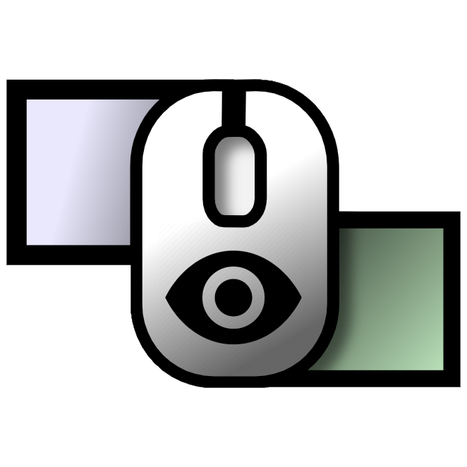

#  LittleBigMouse Manager

This is a third-party tool for [LittleBigMouse](https://github.com/mgth/LittleBigMouse) (LBM) that gives the possibility to enable or disable the daemon depending on the active window.

With LittleBigMouse enabled you may be facing issues while using borderless fullscreen applications/games that will sometimes force you to Alt+Tab to disable it.

If your mouse is behaving weirdly when on the side of the screen (the mouse cursor is stuck when playing Fortnite, moving camera in League of Legends is glitchy, right-click is stuck in Guild Wars 2), you may try this tool.

## Installation

### Basic

- Go to the [releases](https://github.com/VinceBT/LBMM/releases) page and download the latest release's `LBMM.zip` and extract it to your desired location
- Double-click the `LBMM_run.vbs` script, now you should have a new icon inside taskbar notification area
- When focusing a window that is blacklisted in the settings, the LBM icon should turn grey (after the debounce delay). When focusing a non-blacklisted, it should turn back to green (after the debounce delay as well), like this
  

You can edit the `settings.json` to add a program of your choice in the blacklist (you just need to specify the game executable), or to adjust some other settings.
Every change will apply instantly.

### Automatic

The first time you will run the program, it will create a shortcut inside `%AppData%\Microsoft\Windows\Start Menu\Programs\Startup\` so it can launch itself automatically at startup.

You can disable that feature in the settings.

## Settings

All these settings can be changed inside `settings.json`, which will be applied instantly:

- `daemon`: The location of `LittleBigMouse_Daemon.exe` in your file system
- `interval`: The interval in milliseconds between each time the process will check the name of your current focused window, default is `1000ms`
- `debounce`: The debounced time before turning on/off LBM when launching or Alt+Tab-ing a blacklisted application, default is `10000ms`
- `startup`: If this program should launch at Windows startup, default is `true`
- `blacklist`: The list of programs that should turn OFF LBM, feel free to add your own

## Dependencies

You must have [LittleBigMouse](https://github.com/mgth/LittleBigMouse) installed

https://github.com/mgth/LittleBigMouse

## Development

Feel free to submit a pull-request, I know this program is not optimal and could be improved:

- Have NVM installed and type `nvm use` or just install Node 14
- Install dependencies with `npm install`
- Run in development mode with `npm run dev`

## Supports

Windows 10 and Windows 11 (may work on previous versions as well)

## Donation

Feel free to buy me a coffee :)

